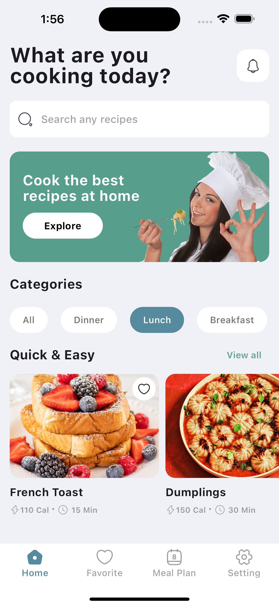
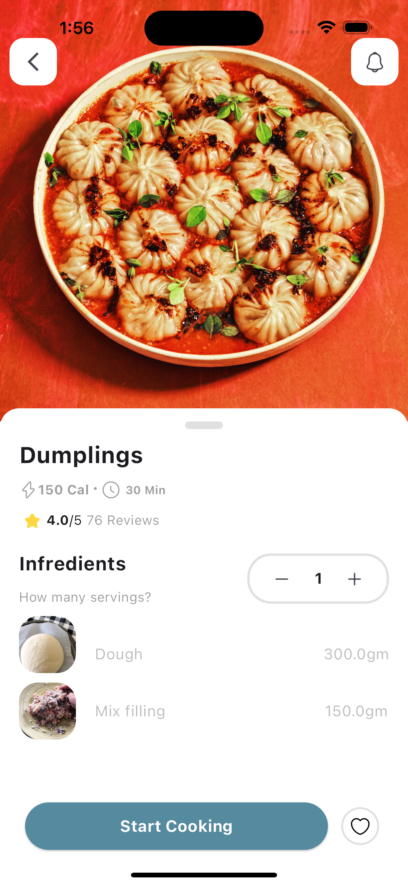
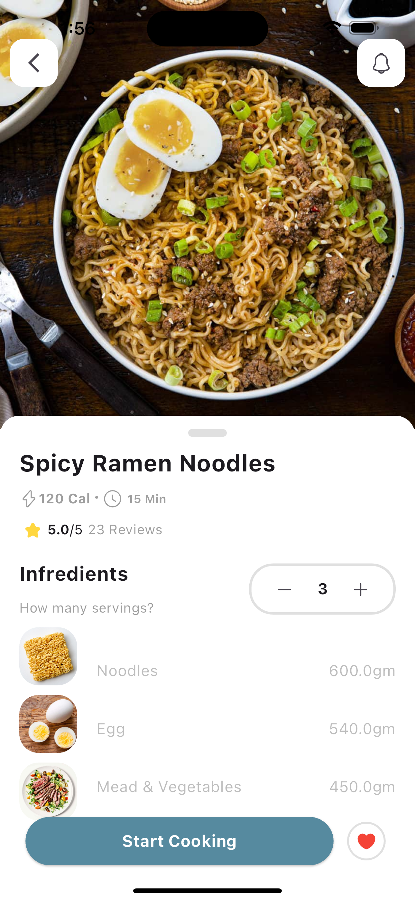
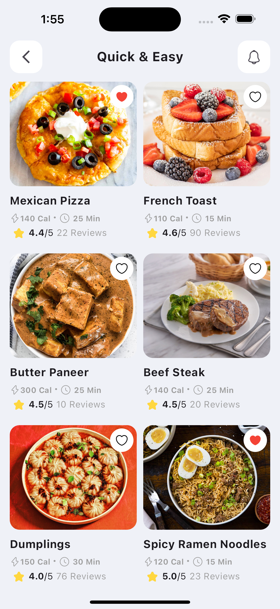
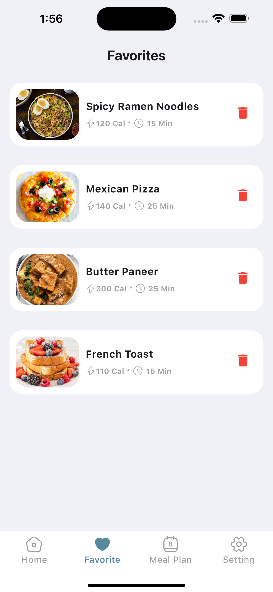

🚀 Recipe App

In this project, we’ll walk you through creating a complete Flutter app from start to finish. The app is a fully functional recipe app that integrates Firebase as the backend for data storage and uses Provider for efficient state management.
This Flutter crash course is perfect for developers looking to understand how to build a Flutter app with a backend, while also managing state and data flow seamlessly. Whether you’re a beginner or an experienced developer, this project will guide you step by step through the process of building your own app.

🛠️ Technologies Used

Flutter – For building cross-platform mobile UI

Dart – Programming language for Flutter

Firebase Firestore – For real-time database & recipe storage

Firebase Storage – For storing recipe images

Provider – For state management

Git & GitHub – For version control and collaboration

VS Code / Android Studio – Development environment

REST APIs (if integrated) – For fetching recipe/nutrition data

Material Design Components – For UI/UX styling

## Upcoming Features 
i
User Authentication - firebaase Authentication
## Screenshot

      

# CookMate-AI
